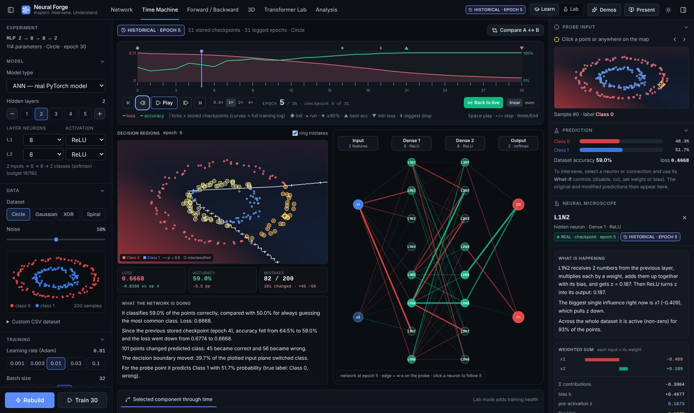
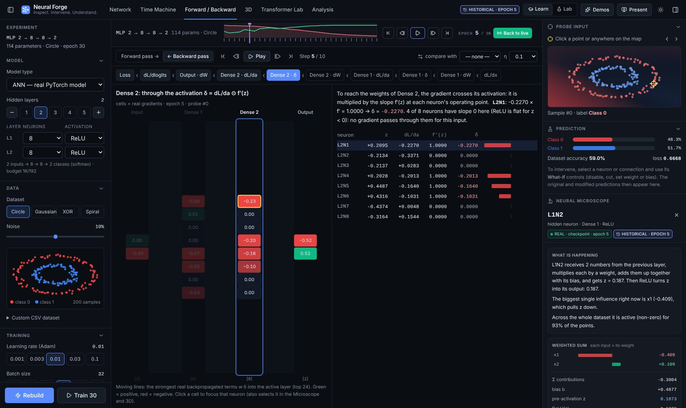
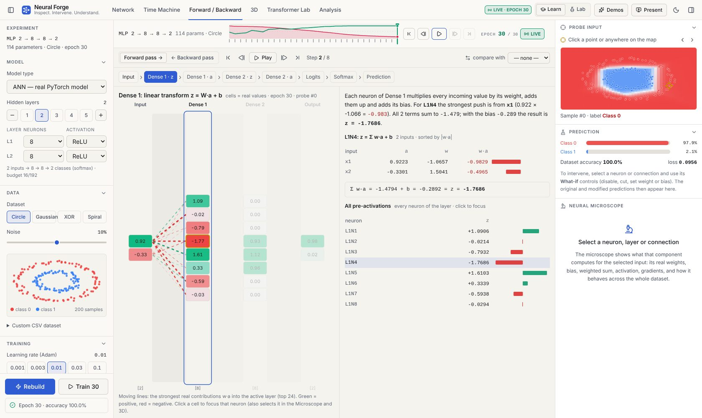
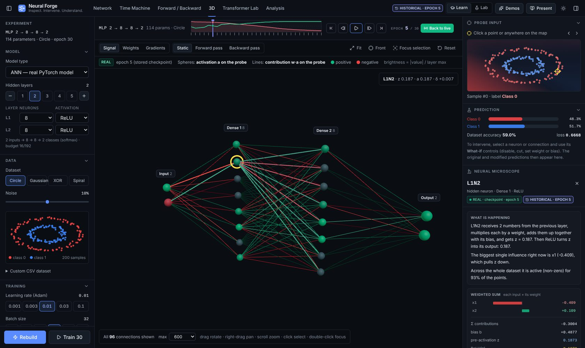
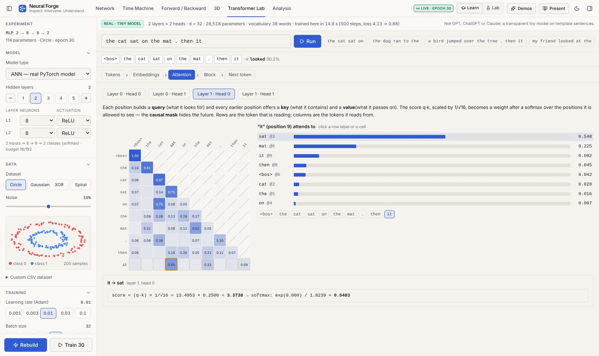

<h1 align="center">Neural Forge</h1>

<p align="center">
  <strong>Inspect. Intervene. Understand.</strong><br/>
  A scientific instrument for looking inside a real neural network: train it, rewind its training, follow one input
  through every multiplication and every gradient, change a neuron and watch the prediction change — in 2D, in 3D,
  and inside a small real Transformer.
</p>

<p align="center"><sub>Neural Forge is built on <a href="https://github.com/PeakScripter/Neural-Visualizer">Neural Visualizer</a> by PeakScripter (GPL-3.0). The original features are preserved and labelled for what they are.</sub></p>

<p align="center">
  
  
  
  
  
  
</p>

<p align="center"></p>

---

## Why it exists

Most neural-network visualisers draw a diagram and animate it. Neural Forge does something stricter:

> **A number is shown as a model internal only if a model computed it.**

Every value in the Network view, Microscope, Time Machine, Forward/Backward Explorer, 3D view and Transformer Lab comes
from a PyTorch forward or backward pass that runs on your machine, and each panel says which weights it used:
`LIVE · EPOCH n`, `HISTORICAL · EPOCH n` (a stored checkpoint) or `WHAT-IF ×n` (a temporary overlay). Views that are
not computed from your model are labelled **ILLUSTRATIVE** or **SYNTHETIC**.

## What you can do

| Workspace | What it shows (all real for ANN/MLP models) |
|---|---|
| **Network** | The live MLP. Edge thickness and colour = the real signal `w·a` on the probe input; node fill = activation. Click (or Tab + Enter) any neuron, layer header or connection. |
| **Neural Microscope** (right column) | For the selected component: inputs, weights, every `w·a`, bias, `z`, activation on its curve, gradients (`dL/da`, `dL/dz`, `dL/db`, `dL/dw`), dataset statistics, dead-neuron detection, response map. Plus the probe input and the prediction. |
| **What-if** | Disable a neuron, cut a connection, set a weight or bias. Applied as an overlay to the forward pass (stored weights never change): original vs after probabilities, dataset accuracy, fraction of flipped predictions, decision regions before/after. Undo / Reset / Restore. |
| **Time Machine** | Every training epoch is an immutable checkpoint. Scrub, step, play, rewind; per-epoch decision regions and mistakes; the selected neuron through time; A ↔ B epoch comparison; training health (Lab). |
| **Forward / Backward** | One probe, step by step. Forward: input → `z = W·a + b` → activation → … → logits → softmax → prediction, with every term of every weighted sum. Backward: loss → `dL/dlogits = p − y` → `dL/dW = δ⊗a` → `Wᵀ·δ` → `δ = dL/da ⊙ f′(z)` → input saliency, `−η·dL/dw`, and a real one-step SGD preview. *Compare with epoch* shows the same pass at another checkpoint. |
| **3D** | The real network in 3D: instanced neurons, batched connections coloured by signal `w·a`, weights or gradients; follows the forward/backward pass with pulses on the strongest real terms; historical checkpoints and what-if edits; orbit / pan / zoom / fit / focus. When not every connection is drawn, it says so ("Showing 600 of 1,152 connections — the strongest by \|w·a\|"). |
| **Transformer Lab** | A tiny real Transformer (2 layers × 2 heads, d = 32, 28.5k parameters) trained locally on template sentences: tokens, embeddings, per-head Q / K / V, scaled scores, causal mask, softmax attention, residual stream, MLP, next-token probabilities, and head ablation. **It is not GPT, ChatGPT or Claude.** |
| **Analysis** | Secondary views, each tagged REAL / ILLUSTRATIVE / SYNTHETIC / TOOL: training curves, decision boundary, a real filter-normalised loss landscape of your model, weight histograms, layer activations, step animations, in-browser TF.js tools, architecture comparison, PyTorch/Keras code export. |
| **Demos & Present** | A first-run welcome with one-click demos and a 10-step presentation journey. They drive the real application (build, train, rewind, select, disable, explore) and narrate the resulting real numbers. |

**Two experiences.** *Explore* (the default for new visitors) is a three-step path for beginners — build a network,
train it and rewind its training, then find its most important neuron by really switching each one off — on the same
real PyTorch model. *Laboratory* is the full instrument set above. Inside the Laboratory, the *Learn* level explains
each view in plain sentences built from the real values; the *Lab* level shows equations, tensor shapes and raw
numbers. Dark and Paper (light) themes.

**English / Italiano.** The interface is translated natively (selector in the top bar; default from the browser
language, remembered in `localStorage`). The page opts out of browser auto-translation (`translate="no"`), which used
to blank the React UI, and error boundaries keep any view crash from taking down the whole app. Not yet translated:
the detailed scientific explanations inside the Laboratory instruments (Microscope, Pass Explorer, Time Machine
notes, Transformer Lab), which stay in English.

<table>
<tr>
<td></td>
<td></td>
</tr>
<tr>
<td></td>
<td></td>
</tr>
</table>

## Real vs illustrative

| Model type | Status |
|---|---|
| **ANN (MLP)** | **Real.** PyTorch model, real training (Adam, cross-entropy), checkpoints, Microscope, What-if, Time Machine, Forward/Backward Explorer, 3D, loss landscape. Binary classification on 2-D synthetic datasets or a CSV (up to 16 features, labels 0/1). |
| **Transformer Lab** | **Real, but a separate tiny model** trained locally on a synthetic corpus — not the "Transformer" option of the model selector. |
| CNN, RNN, LSTM, GAN, Transformer, Diffuser (model selector) | **Illustrative diagrams.** Node values are placeholders; "Simulate" produces a synthetic curve. The Forge instruments refuse to inspect them. |
| Live Train, LR Sweep, Custom Activation | Real TensorFlow.js models trained in the browser, separate from the Forge session. |
| Attention pattern (Analysis) | Synthetic, kept as a labelled legacy diagram; the real attention matrices are in Transformer Lab. |

See [docs/AUDIT_AND_ROADMAP.md](docs/AUDIT_AND_ROADMAP.md) for the full audit of every view.

## Architecture

```
frontend/ (React 19, TypeScript, Vite, Tailwind, Zustand, D3, Three.js / R3F)
  src/app/            workspace + experiment actions, demos and presentation journey
  src/forge/          wire types, API client, stores (experiment, time machine, explorer, transformer lab),
                      pure helpers for the explorer and the 3D scene (unit-tested)
  src/components/     Shell (top bar, experiment panel, inspector), Workspaces, Forge (Microscope,
                      Time Machine, Explorer, ThreeD), Transformer, legacy Visualizations
  e2e/                Playwright smoke tests (start the real backend and frontend)
backend/ (FastAPI, PyTorch)
  forge/mlp.py        functional MLP with a full forward trace
  forge/session.py    model sessions, real training, checkpoints
  forge/introspect.py Microscope payloads, what-if comparison, computation trace (Pass Explorer / 3D)
  forge/timemachine.py read-only history views
  forge/landscape.py  loss landscape of the session model
  forge/transformer.py the Transformer Lab model, training and trace
  forge/api.py        /api/forge/* router
  main.py, compute.py, models.py  legacy illustrative endpoints
```

Details: [docs/ARCHITECTURE.md](docs/ARCHITECTURE.md) · demo script: [docs/DEMO.md](docs/DEMO.md) · tests: [docs/TESTING.md](docs/TESTING.md).

## Getting started

**Requirements:** Python 3.10+ (tested with 3.12 and 3.13), Node.js 20+ (tested with 22), ~1 GB disk for CPU PyTorch.
No API keys, accounts or paid services.

```bash
git clone https://github.com/ottopwn/Neural-Visualizer.git
cd Neural-Visualizer
./start.sh --setup      # once: CPU-only PyTorch + backend deps + npm ci
./start.sh              # backend on :8000, frontend on http://127.0.0.1:5173
```

Manual setup (any OS):

```bash
# backend
cd backend
python -m pip install torch --index-url https://download.pytorch.org/whl/cpu   # CPU wheel (much smaller)
python -m pip install -r requirements-dev.txt
python -m uvicorn main:app --host 127.0.0.1 --port 8000

# frontend (second terminal)
cd frontend
npm ci
npm run dev            # http://localhost:5173
```

The frontend calls the backend at `VITE_API_BASE_URL` (default `http://localhost:8000`, see `frontend/.env.example`).
Run uvicorn with a **single worker**: model sessions and checkpoints live in the backend process memory (8 sessions,
LRU) and are lost on restart — just click **Build** again. The Transformer Lab model trains on first use (≈ 5–10 s on a
laptop CPU) once per backend process.

## Testing

```bash
cd backend  && python -m pytest -q          # 74 tests: numerics vs independent autograd, training, API
cd frontend && npm test                     # 84 unit tests (stores, explorer/3D helpers on a real trace)
cd frontend && npm run lint && npm run typecheck && npm run build
cd frontend && npx playwright install chromium && npm run test:e2e   # 13 browser tests (start both servers)
```

GitHub Actions ([.github/workflows/ci.yml](.github/workflows/ci.yml)) runs all of the above on every push and pull request.

## Limitations

- Real introspection covers MLP classifiers (2 classes; 1–5 hidden layers; ≤ 192 hidden neurons in the UI, ≤ 128 per layer).
  Decision regions and response maps need 2-D inputs.
- Sessions and checkpoints are in memory (single process); at most 48 checkpoints per session are kept (balanced
  spacing), so long runs cannot visit every epoch.
- Gradients in the Microscope and the explorer are for one probe input; the SGD preview is plain gradient descent on
  that input, while real training uses Adam on mini-batches.
- The 3D view draws at most the selected number of connections (default 600) and discloses it.
- The Transformer Lab model is a toy: word-level vocabulary of 38 template words, context 24; unknown words become `<unk>`.
- No experiment export/import yet.

## Earlier demo video

The original demo video (recorded with the pre-Forge Neural Visualizer interface) is still available:
https://github.com/user-attachments/assets/fc5b9114-0085-40b6-bdf9-fa3208ce19ff

## License

GNU General Public License v3.0 — see [LICENSE](LICENSE). Neural Forge is a derivative of
[PeakScripter/Neural-Visualizer](https://github.com/PeakScripter/Neural-Visualizer) (GPL-3.0); the original code and its
features remain under the same license.
